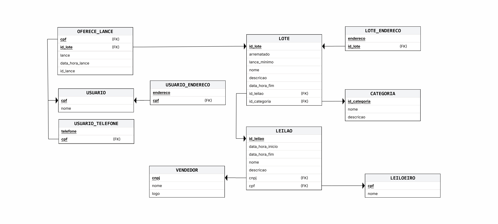

# Diagrama Relacional

# Dicionário de Dados
## USUARIO

| Atributo | Tipo | Chave | Nulo | Descrição |
|---|---|---|---|---|
| cpf | CHAR(11) | PK | Não | CPF do usuário, identificador único |
| nome | VARCHAR(100) | | Não | Nome completo do usuário |

## USUARIO_TELEFONE

| Atributo | Tipo | Chave | Nulo | Descrição |
|---|---|---|---|---|
| telefone | VARCHAR(20) | PK | Não | Número de telefone |
| cpf | CHAR(11) | PK/FK | Não | Referência USUARIO(cpf) |

## USUARIO_ENDERECO

| Atributo | Tipo | Chave | Nulo | Descrição |
|---|---|---|---|---|
| endereco | VARCHAR(200) | PK | Não | Endereço do usuário |
| cpf | CHAR(11) | PK/FK | Não | Referência USUARIO(cpf) |

## OFERECE_LANCE

| Atributo | Tipo | Chave | Nulo | Descrição |
|---|---|---|---|---|
| cpf | CHAR(11) | PK/FK | Não | Referência USUARIO(cpf) |
| id_lote | INT | PK/FK | Não | Referência LOTE(id_lote) |
| id_lance | INT | PK | Não | Identificador do lance dentro do lote |
| lance | DECIMAL(15,2) | | Não | Valor monetário do lance |
| data_hora_lance | DATETIME | | Não | Data e hora em que o lance foi feito |

## LOTE

| Atributo | Tipo | Chave | Nulo | Descrição |
|---|---|---|---|---|
| id_lote | INT | PK | Não | Identificador único do lote |
| nome | VARCHAR(150) | | Não | Nome do lote |
| descricao | TEXT | | Sim | Descrição detalhada do lote |
| arrematado | BOOLEAN | | Não | Indica se o lote foi arrematado |
| lance_minimo | DECIMAL(15,2) | | Não | Valor mínimo para abertura de lances |
| data_hora_fim | DATETIME | | Não | Data e hora de encerramento do lote |
| id_leilao | INT | FK | Não | Referência LEILAO(id_leilao) |
| id_categoria | INT | FK | Não | Referência CATEGORIA(id_categoria) |

## LOTE_ENDERECO

| Atributo | Tipo | Chave | Nulo | Descrição |
|---|---|---|---|---|
| endereco | VARCHAR(200) | PK | Não | Endereço físico do lote |
| id_lote | INT | PK/FK | Não | Referência LOTE(id_lote) |

## CATEGORIA

| Atributo | Tipo | Chave | Nulo | Descrição |
|---|---|---|---|---|
| id_categoria | INT | PK | Não | Identificador único da categoria |
| nome | VARCHAR(100) | | Não | Nome da categoria |
| descricao | TEXT | | Sim | Descrição da categoria |

## LEILAO

| Atributo | Tipo | Chave | Nulo | Descrição |
|---|---|---|---|---|
| id_leilao | INT | PK | Não | Identificador único do leilão |
| nome | VARCHAR(150) | | Não | Nome do leilão |
| descricao | TEXT | | Sim | Descrição do leilão |
| data_hora_inicio | DATETIME | | Não | Data e hora de início do leilão |
| data_hora_fim | DATETIME | | Não | Data e hora do fim do leilão |
| cnpj | CHAR(14) | FK | Não | Referência VENDEDOR(cnpj) |
| cpf | CHAR(11) | FK | Não | Referência LEILOEIRO(cpf) |

## VENDEDOR

| Atributo | Tipo | Chave | Nulo | Descrição |
|---|---|---|---|---|
| cnpj | CHAR(14) | PK | Não | CNPJ do vendedor, identificador único |
| nome | VARCHAR(150) | | Não | Razão social ou nome fantasia |
| logo | VARCHAR(255) | | Sim | Logomarca do vendedor |

## LEILOEIRO

| Atributo | Tipo | Chave | Nulo | Descrição |
|---|---|---|---|---|
| cpf | CHAR(11) | PK | Não | CPF do leiloeiro, identificador único |
| nome | VARCHAR(100) | | Não | Nome completo do leiloeiro |
